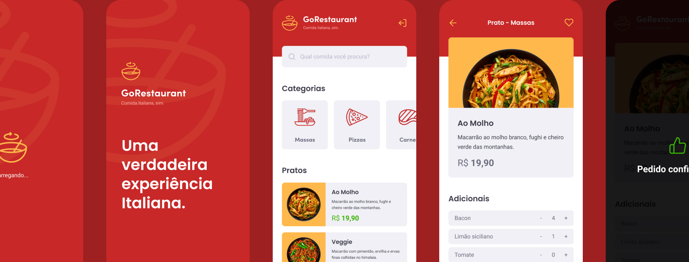

<h3 align="center">
  Challenge 11: GoRestaurant Mobile
</h3>

  

### 🚀 About the challenge

In this challenge, you will develop another application, GoRestaurant, only this time the mobile version for the customer. Now you will practice what you have learned so far in React Native together with TypeScript, to create a small app for ordering food.

This will be an application that will connect to a Fake API, and display and filter API food dishes and allow the creation of new orders.

### Tests Specification

-**`should be able to list the food plates`**: In order for this test to pass, your application must allow all food dishes that are returned from your fake API to be listed on your` Dashboard`.

-**`should be able to list the food plates filtered by category`**: In order for this test to pass, your application must allow the food dishes filtered by category of your fake API to be listed on your` Dashboard`.

**Tip**: On json-server you can normally use query params to search / filter according to the value of an item field in the server.json file. For example, to filter all dishes with category 1, your url would look like `http: // localhost: 3000 / foods? Category_like = 1`.

-**`should be able to list the food plates filtered by name search`**: In order for this test to pass, your application must allow food dishes filtered by the name of your fake API to be listed on your` Dashboard` .

**Tip**: On json-server you can normally use query params to search / filter according to the value of an item field in the server.json file. For example, to filter all dishes with the name Veggie, your url would look like `http: // localhost: 3000 / foods? Name_like = Veggie`.

-**`should be able to navigate to the food details page`**: For this test to pass, on your` Dashboard`, you must allow that when clicking on an item, it is navigated to the `FoodDetails` page passing through navigation parameter the id of the item clicked.

-**`should be able to list the favorite food plates`**: In order for this test to pass, your application must allow all food dishes that are saved in the` favorites` route to be listed on your `Favorites` page. .

-**`should be able to list the orders`**: In order for this test to pass, your application must allow all food dishes that are saved on the` orders` route to be listed on your `Orders` page.

-**`should be able to list the food`**: In order for this test to pass, your application must allow all data for a specific food to be listed on the` FoodDetails` page, based on the id retrieved by the route parameters.

**Tip 1**: Use the `useRoute` hook to get the` params` attribute that will contain the id sent by parameter.

**Tip 2**: With the id retrieved by navigation parameter, search your API with updated food data in the `/ foods /: id` wheel.

-**`should be able to increment food quantity`**: For this test to pass, you must allow the item quantity on the` FoodDetails` page to be incremented by 1.

-**`should be able to decrement food quantity`**: For this test to pass, you must allow the item quantity on the` FoodDetails` page to be decreased by 1.

**Tip**: Do not allow the value of the input to be changed to less than 1, so that the order always has at least one item.

-**`should not be able to decrement food quantity below than 1`**: In order for this test to pass, you must prevent the number of items from being decreased to less than 1, thus the minimum number of items in the order is 1.

-**`should be able to increment an extra item quantity`**: In order for this test to pass, you must allow the amount of an extra ingredient on the` FoodDetails` page to be increased by 1 based on your id.

-**`should be able to decrement an extra item quantity`**: In order for this test to pass, you must allow the amount of an extra ingredient on the` FoodDetails` page to be decreased by 1 based on your id.

<<<<<<< HEAD
=======

>>>>>>> 11af8dbc4762c684e75c34e84b3b5792eb1f59b1

---

Made with ❤️ by morikawa77
